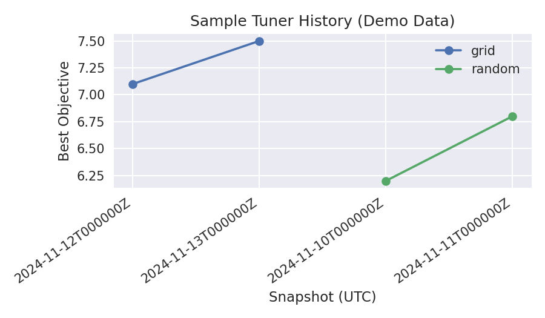

Telemetry-Driven Tuning
=======================

The hyperparameter tuning CLIs (`fhops tune-random`, `fhops tune-grid`, `fhops tune-bayes`)
log every run to JSONL and automatically mirror the same data into
``telemetry/runs.sqlite``. This guide walks through a lightweight sweep,
generating a tuning report, and interpreting the resulting artefacts.

Prerequisites
-------------

* FHOPS installed in your virtual environment (``pip install -e .[dev]``).
* The example scenarios shipped under ``examples/`` (installed with the project).

Step 1 – Collect Telemetry
--------------------------

Pick a directory for the telemetry bundle and point each tuning command at the
same ``--telemetry-log`` path. FHOPS will create the JSONL file plus a mirrored
SQLite database alongside it.

.. code-block:: bash

   mkdir -p tmp/tuner-demo

   fhops tune-random examples/minitoy/scenario.yaml \
       --runs 2 \
       --iters 150 \
       --telemetry-log tmp/tuner-demo/runs.jsonl

   fhops tune-grid examples/minitoy/scenario.yaml \
       --batch-size 1 \
       --batch-size 2 \
       --preset balanced \
       --preset explore \
       --iters 150 \
       --telemetry-log tmp/tuner-demo/runs.jsonl

   fhops tune-bayes examples/minitoy/scenario.yaml \
       --trials 3 \
       --iters 150 \
       --telemetry-log tmp/tuner-demo/runs.jsonl

After those commands complete you will have:

* ``tmp/tuner-demo/runs.jsonl`` — append-only log of each run.
* ``tmp/tuner-demo/runs.sqlite`` — structured tables (`runs`, `run_metrics`,
  `run_kpis`, and `tuner_summaries`) that mirror the JSONL payload.
* ``tmp/tuner-demo/steps/<run_id>.jsonl`` — optional per-step logs (only when
  the solver emits granular snapshots).

Step 2 – Generate a Comparison Report
-------------------------------------

Use the ``fhops telemetry report`` subcommand to aggregate the SQLite store into
machine-readable (CSV) and human-readable (Markdown) summaries:

.. code-block:: bash

   fhops telemetry report tmp/tuner-demo/runs.sqlite \
       --out-csv tmp/tuner-demo/tuner_report.csv \
       --out-markdown tmp/tuner-demo/tuner_report.md

The command prints a Markdown table to stdout by default; passing ``--out-*``
flags writes the same content to disk. The generated CSV columns include
aggregated statistics (best/mean objective, run counts) plus any matching
``tuner_summaries`` rows added by the CLI commands. Continuous integration
executes this pipeline for **minitoy** and **med42** so the published artefacts
already contain multiple scenarios.

Sample Output
-------------

Markdown table (``tmp/tuner-demo/tuner_report.md``) for a short sweep:

.. code-block:: text

   | Algorithm | Scenario | Best Objective | Mean Objective | Runs | Summary Best | Configurations |
   | --- | --- | --- | --- | --- | --- | --- |
   | bayes | FHOPS MiniToy | 8.125 | 8.125 | 1 | 8.125 | 3 |
   | grid | FHOPS MiniToy | 7.750 | 7.438 | 4 | 7.750 | 4 |
   | random | FHOPS MiniToy | 7.375 | 6.812 | 2 | 7.375 | 2 |

Step 3 – Iterate
----------------

* Use the CSV file for deeper analysis in pandas/Polars or to drive dashboards.
* Inspect the Markdown report (or the uploaded CI artefact) in code reviews to
  track how a branch affects tuning performance.
* Because the report operates directly on the SQLite store, you can rerun it at
  any time without regenerating telemetry.

Step 4 – Compare Multiple Reports
---------------------------------

To track changes across branches or nightly runs, use
``scripts/analyze_tuner_reports.py`` to merge several ``tuner_report.csv`` files
and compute deltas against a baseline:

.. code-block:: bash

   python scripts/analyze_tuner_reports.py \
       baseline=tmp/ci-telemetry/tuner_report.csv \
       experiment=tmp/local/tuner_report.csv \
       --out-markdown tmp/comparison.md \
       --out-csv tmp/comparison.csv \
       --out-chart tmp/comparison.html

The script aligns records on (algorithm, scenario) and appends ``best_delta_*``
columns showing the improvement relative to the first report label.
Passing ``--out-chart`` generates an Altair HTML visualization of best objectives per algorithm.

Historical Trends
-----------------

Keep dated copies of ``tuner_report.csv`` snapshots (for example, download the
``telemetry-report`` artifact from multiple CI runs) and place them in a single
directory. Then call ``analyze_tuner_reports.py`` with ``--history-dir`` to
produce a longitudinal view:

.. code-block:: bash

   python scripts/analyze_tuner_reports.py \
       --report latest=tmp/ci-telemetry/tuner_report.csv \
       --history-dir docs/examples/analytics/data/tuner_reports \
       --out-history-csv tmp/history.csv \
       --out-history-markdown tmp/history.md \
       --out-history-chart tmp/history.html

The generated history table lists the best/mean objectives per algorithm and
scenario across snapshots (derived from the filename stem). When the source
telemetry includes extra KPIs (total production, mobilisation cost, downtime
hours, weather severity, utilisation ratios) they appear as additional columns in
the history summary. The optional Altair chart highlights objective trends at a
glance.

Continuous integration already copies the minitoy smoke sweep into the
``history/`` subdirectory of the ``telemetry-report`` artifact using UTC
timestamps, so you can download successive runs and feed them directly to the
history command. The workflow also generates ``history_summary.{csv,md,html}``
via ``analyze_tuner_reports.py --history-dir`` so you can inspect trends
immediately after downloading the artifact.

Delta Snapshot Summary
----------------------

For a quick “what changed since last snapshot” view, pass ``--out-history-delta-*`` when
invoking ``analyze_tuner_reports.py``. The CI workflow already produces
``history_delta.{csv,md}``, summarising the latest vs. previous snapshot for objectives and KPIs.
Example command:

.. code-block:: bash

   python scripts/analyze_tuner_reports.py \
       --history-dir docs/examples/analytics/data/tuner_reports \
       --out-history-delta-csv tmp/history_delta.csv \
       --out-history-delta-markdown tmp/history_delta.md

   Sample telemetry history derived from the committed demo data. Actual CI
   artefacts contain the latest minitoy and med42 measurements.

CI Automation
-------------

The main CI workflow runs a nightly smoke sweep on ``examples/minitoy`` and
uploads ``tmp/ci-telemetry/tuner_report.{csv,md}`` as build artefacts. Use those
artefacts as a baseline when evaluating new heuristics or tuning strategies.

For longer experiments (e.g., synthetic bundles or larger iteration budgets),
reuse the same workflow with adjusted ``--runs`` / ``--trials`` / ``--iters``
parameters and point the telemetry log at a scenario-specific directory.

Downloading CI Reports
----------------------

Each CI run exposes a ``telemetry-report`` artefact containing the latest
``tuner_report.{csv,md}`` files alongside the raw telemetry bundle. To download:

* Via the GitHub web UI: open the completed workflow run, expand the **Artifacts**
  section, and click ``telemetry-report`` to fetch the zip file.
* Via the command line (requires `gh`):

  .. code-block:: bash

     gh run download --repo <owner>/<repo> --name telemetry-report --dir tmp/ci-telemetry

After extraction, inspect ``tuner_report.md`` directly or load
``tuner_report.csv`` into pandas/Polars for deeper analysis.
